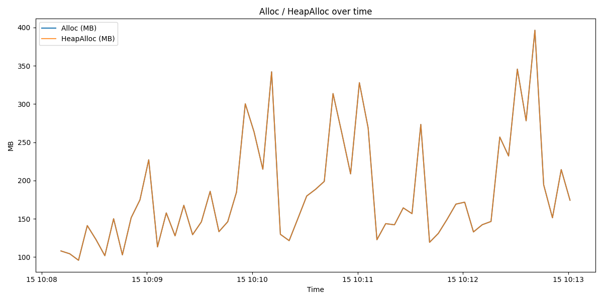
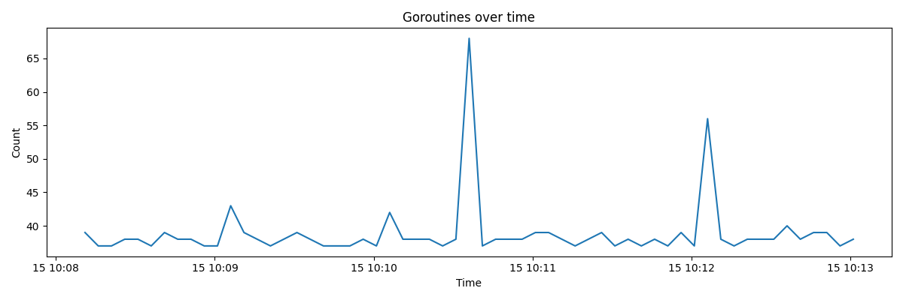
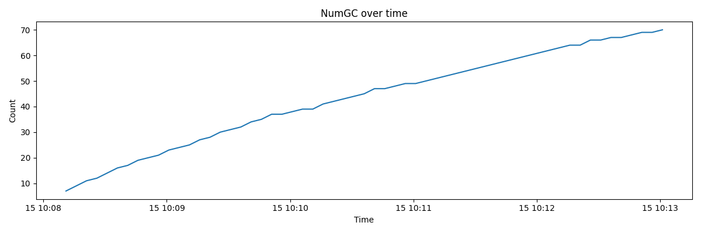
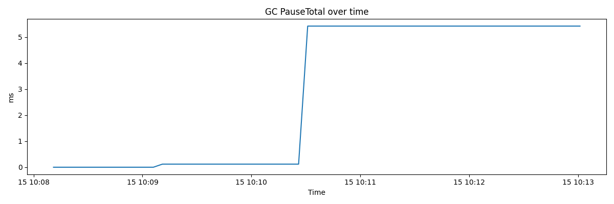

# 智能工厂设备监控系统

## 项目简介

智能工厂设备监控系统是一个基于Go语言开发的工业物联网(IIoT)解决方案，使用sfsDb作为时序数据库存储和分析设备传感器数据。系统提供设备管理、传感器数据采集、存储、分析、告警等功能，为工厂设备的运行状态提供实时监控和分析能力。

## 系统架构

系统采用模块化设计，主要包含以下核心模块：

1. **配置管理** (`config.go`) - 处理系统配置加载和验证
2. **设备管理** (`device.go`) - 负责设备注册、状态监控和管理
3. **传感器数据处理** (`sensor.go`) - 处理传感器数据的采集、验证和批处理
4. **数据存储** (`storage.go`) - 使用sfsDb存储时序数据和查询
5. **告警管理** (`alert.go`) - 基于阈值的告警检测和通知
6. **数据分析** (`analytics.go`) - 提供趋势分析和异常检测功能
7. **API接口** (`api.go`) - 提供RESTful API接口

## 核心功能

### 1. 设备管理
- 设备注册和管理
- 设备状态监控
- 传感器管理
- 设备扫描和发现

### 2. 传感器数据处理
- 传感器数据采集
- 数据质量检查
- 批处理和验证
- 数据标准化

### 3. 时序数据存储
- 使用sfsDb作为时序数据库
- 支持时间序列数据存储
- 提供数据聚合功能
- 支持不同时间粒度的查询

### 4. 告警系统
- 基于阈值的告警检测
- 多级别告警（信息、警告、严重）
- 告警通知
- 告警历史记录

### 5. 数据分析
- 趋势分析
- 异常检测
- 数据预测
- 统计分析

### 6. API接口
- RESTful API设计
- 设备管理接口
- 传感器数据查询接口
- 告警管理接口
- 统计分析接口

## 技术栈

- **开发语言**: Go 1.21+
- **时序数据库**: sfsDb
- **Web框架**: 标准库 `net/http`
- **配置管理**: YAML
- **数据格式**: JSON

## 安装与运行

### 前置条件

- Go 1.21 或更高版本
- sfsDb 依赖包

### 安装步骤

1. **克隆项目**

2. **安装依赖**
   ```bash
   go mod tidy
   ```

3. **配置系统**
   编辑 `config.yaml` 文件，设置数据库路径和其他配置参数

4. **编译项目**
   ```bash
   go build -o sfsDbIIoT.exe
   ```

5. **运行系统**
   ```bash
   ./sfsDbIIoT.exe
   ```
   或使用提供的批处理脚本
   ```bash
   ./run.bat
   ```

## 配置说明

配置文件 `config.yaml` 包含以下主要配置项：

- `server.port`: API服务端口
- `database.path`: 数据库存储路径
- `database.retention_days`: 数据保留天数
- `alert.check_interval`: 告警检查间隔（秒）
- `sensor.batch_size`: 传感器数据批处理大小
- `sensor.check_interval`: 传感器数据检查间隔（秒）

## API接口

### 1. 设备管理

- **GET /api/devices** - 获取所有设备列表
- **GET /api/devices/{id}** - 获取指定设备详情
- **POST /api/devices** - 注册新设备
- **PUT /api/devices/{id}** - 更新设备信息
- **DELETE /api/devices/{id}** - 删除设备

### 2. 传感器数据

- **GET /api/sensors** - 获取所有传感器列表
- **GET /api/sensors/{id}** - 获取指定传感器详情
- **GET /api/sensor-data** - 查询传感器数据
  - 参数: `device_id`, `sensor_id`, `start_time`, `end_time`, `granularity`, `aggregation`

### 3. 告警管理

- **GET /api/alerts** - 获取告警列表
  - 参数: `severity`, `status`, `start_time`, `end_time`
- **GET /api/alerts/{id}** - 获取指定告警详情
- **PUT /api/alerts/{id}/acknowledge** - 确认告警

### 4. 统计分析

- **GET /api/analytics/trends** - 获取趋势分析
  - 参数: `device_id`, `sensor_id`, `start_time`, `end_time`, `granularity`
- **GET /api/analytics/anomalies** - 获取异常检测结果
  - 参数: `device_id`, `sensor_id`, `start_time`, `end_time`

## 示例使用

### 1. 设备注册

系统启动时会自动注册示例设备，或通过API注册新设备：

```bash
curl -X POST http://localhost:8080/api/devices \
  -H "Content-Type: application/json" \
  -d '{"id":"device-003","name":"冲压机","type":"manufacturing","location":"车间C"}'
```

### 2. 数据查询

查询设备传感器数据，带聚合功能：

```bash
curl "http://localhost:8080/api/sensor-data?device_id=device-001&sensor_id=temperature&start_time=2024-01-01T00:00:00Z&end_time=2024-01-02T00:00:00Z&granularity=hour&aggregation=avg"
```

### 3. 告警查询

查询严重级别的告警：

```bash
curl "http://localhost:8080/api/alerts?severity=critical"
```

## 项目结构

```
sfsDbIIoT/
├── alert.go        # 告警管理模块
├── analytics.go    # 数据分析模块
├── api.go          # API接口模块
├── config.go       # 配置管理模块
├── config.yaml     # 配置文件
├── device.go       # 设备管理模块
├── go.mod          # Go模块文件
├── go.sum          # 依赖版本锁定文件
├── main.go         # 主程序入口
├── run.bat         # 运行脚本
├── sensor.go       # 传感器数据处理模块
├── storage.go      # 数据存储模块
└── data/           # 数据库存储目录
```

## 核心技术特性

### 1. 时序数据处理

系统使用sfsDb的time包提供时序数据库功能，支持以下时间粒度的聚合：

- 秒 (second)
- 分钟 (minute)
- 小时 (hour)
- 天 (day)
- 周 (week)
- 月 (month)

支持的聚合函数：

- 平均值 (avg)
- 最大值 (max)
- 最小值 (min)
- 总和 (sum)
- 计数 (count)

### 2. 批处理机制

传感器数据采用批处理机制，提高数据处理效率：

- 批量收集传感器数据
- 批量验证和处理
- 批量存储到数据库

### 3. 异常检测

系统内置异常检测算法，基于统计方法识别异常数据：

- 移动平均线偏差检测
- 标准差异常检测

### 4. 可扩展性

系统设计考虑了可扩展性：

- 模块化架构便于添加新功能
- 支持水平扩展以处理更多设备
- 可自定义告警规则和分析算法

## 注意事项

1. **数据库路径**：确保配置文件中的数据库路径存在且有写入权限
2. **端口占用**：默认API端口为8080，确保该端口未被占用
3. **数据保留**：默认数据保留30天，可根据实际需求调整
4. **告警阈值**：建议根据设备特性设置合理的告警阈值
5. **性能优化**：对于大规模部署，建议调整批处理大小和检查间隔

## 生产环境建议

1. **高可用性**：考虑部署多实例并使用负载均衡
2. **数据备份**：定期备份数据库文件
3. **监控**：部署系统监控，监控系统自身的运行状态
4. **安全**：配置适当的网络安全措施，限制API访问
5. **测试**：在生产环境部署前进行充分的测试

## 许可证

MIT License

## 贡献

欢迎提交Issue和Pull Request来改进这个项目。

## 基准测试与性能报告

本仓库包含针对 `sfsDb` 写入/查询与告警路径的基准测试实验，相关产物位于仓库根目录：

- `bench_results.txt` / `bench_results_round2.txt` / `bench_results_round3.txt` - 各轮基准测试的控制台输出摘要
- `bench_results_sustained_round1.txt` / `bench_results_sustained_round2.txt` - 持续写入测试输出（300s 并发 10）
- `bench_sustained_metrics_round2.json` - 每 5 秒采样的运行时指标（JSON）
- `bench_sustained_metrics_round2.csv` - 同上，CSV 格式，便于绘图
- `bench_sustained_metrics_round2_summary.txt` - 采样统计摘要（min/mean/p50/p95/p99/max）

下面是从持续写入测试（并发=10，持续=300s）生成的关键图表：

Alloc / HeapAlloc (MB)



Goroutines



NumGC



GC PauseTotal (ms)



简短结论：在本机和当前配置下，短时峰值测试显示非常高的写入吞吐，持续写入测试（5 分钟、并发 10）揭示系统的稳定吞吐约为 4k–4.5k ops/sec，内存中位 ~158MB，p95 峰值接近 342MB。详见上述 CSV/JSON 与摘要文件以作深入分析。

如需进一步自动化对比（多并发/批量扫描）、生成 PDF 报告或禁用告警/日志后的对照试验，请打开 Issue 或联系维护者。

## 联系方式

如有问题或建议，请通过以下方式联系：

- 项目地址：https://github.com/yourusername/sfsDbIIoT
- 电子邮件：your.email@example.com
